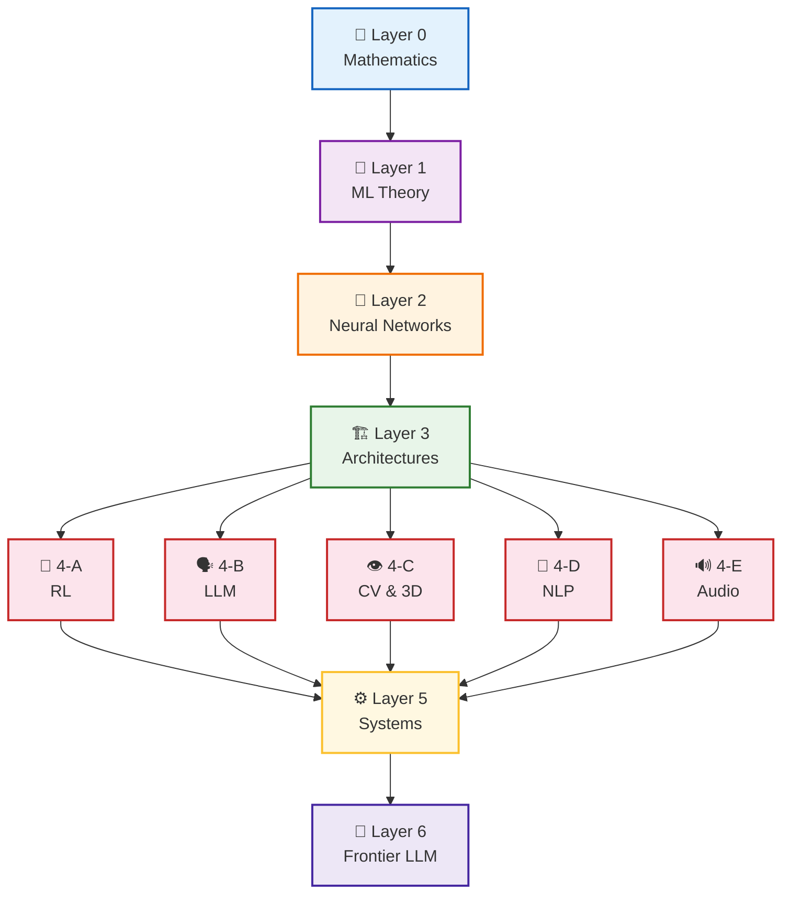
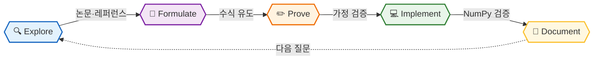

<h1 align="center">
  
  IQ AI Lab
</h1>

**수학적 증명으로 AI의 본질을 파고드는 딥다이브 연구소**

 

 

> *"Prove, don't memorize — the math behind AI."*

표면적인 사용법이 아닌,  
**왜 이 수식인가 — 가정부터 증명까지** 를 집요하게 파고듭니다.

 

---

## 🗺️ Learning Roadmap

---

## 📚 Projects & Studies

 

&nbsp;🧮 &nbsp;<b>Layer 0 — Mathematics</b> &nbsp;&nbsp;

 

> AI의 모든 수식이 여기서 출발합니다

| &nbsp; | 📌 Title | 📝 Key Topics |
|:--:|:---------|:----------|
| 1 | [**Linear Algebra Deep Dive**](https://github.com/iq-ai-lab/linear-algebra-deep-dive) | 벡터공간, 고유값 분해, SVD, PCA 증명, 텐서 |
| 2 | [**Probability Theory Deep Dive**](https://github.com/iq-ai-lab/probability-theory-deep-dive) | 측도 기반 확률론, 조건부 기댓값, 수렴 4종, 마팅게일 |
| 3 | [**Mathematical Statistics Deep Dive**](https://github.com/iq-ai-lab/mathematical-statistics-deep-dive) | MLE/MAP 유도, 가설검정, 점근이론, 베이즈 추론 |
| 4 | [**Calculus & Optimization Deep Dive**](https://github.com/iq-ai-lab/calculus-optimization-deep-dive) | 편미분, 야코비안, 헤시안, 라그랑주 승수법 |
| 5 | [**Convex Optimization Deep Dive**](https://github.com/iq-ai-lab/convex-optimization-deep-dive) | 볼록 집합/함수, KKT 조건, 쌍대이론, Proximal 방법 |
| 6 | [**Information Theory Deep Dive**](https://github.com/iq-ai-lab/information-theory-deep-dive) | Shannon Entropy, KL-Divergence, 상호정보량, MDL |
| 7 | [**Stochastic Processes Deep Dive**](https://github.com/iq-ai-lab/stochastic-processes-deep-dive) | 마르코프 체인, 브라운 운동, 마팅게일, MCMC |
| 8 | [**Stochastic Differential Equations Deep Dive**](https://github.com/iq-ai-lab/sde-deep-dive) | 이토 적분, 이토 공식, SDE, Fokker-Planck 방정식 |
| 9 | [**Functional Analysis Deep Dive**](https://github.com/iq-ai-lab/functional-analysis-deep-dive) | 힐베르트 공간, 스펙트럴 이론, RKHS |
| 10 | [**Information Geometry Deep Dive**](https://github.com/iq-ai-lab/information-geometry-deep-dive) | 통계다양체, Fisher 정보 행렬, Natural Gradient |

 

---

&nbsp;📐 &nbsp;<b>Layer 1 — ML Theory</b> &nbsp;&nbsp;

 

> 고전 ML의 수학적 토대와 일반화 이론

| &nbsp; | 📌 Title | 📝 Key Topics |
|:--:|:---------|:----------|
| 1 | [**ML Fundamentals Deep Dive**](https://github.com/iq-ai-lab/ml-fundamentals-deep-dive) | 선형회귀(Normal Equation 유도), 결정트리, 앙상블 수렴 증명 |
| 2 | [**Statistical Learning Theory Deep Dive**](https://github.com/iq-ai-lab/statistical-learning-theory-deep-dive) | PAC Learning, VC 차원, Rademacher 복잡도, 균등수렴 |
| 3 | [**Kernel Methods Deep Dive**](https://github.com/iq-ai-lab/kernel-methods-deep-dive) | Mercer 정리, RKHS, SVM 쌍대 유도, 가우시안 프로세스 |
| 4 | [**Bayesian ML Deep Dive**](https://github.com/iq-ai-lab/bayesian-ml-deep-dive) | 베이지안 추론, 변분 베이즈, ELBO 유도, MCMC |
| 5 | [**Graphical Models Deep Dive**](https://github.com/iq-ai-lab/graphical-models-deep-dive) | 베이지안 네트워크, 마르코프 랜덤 필드, 믿음 전파 |

 

---

&nbsp;🧠 &nbsp;<b>Layer 2 — Neural Network Theory</b> &nbsp;&nbsp;

 

> 신경망의 수학적 본질 — 역전파부터 일반화까지

| &nbsp; | 📌 Title | 📝 Key Topics |
|:--:|:---------|:----------|
| 1 | [**Neural Network Theory Deep Dive**](https://github.com/iq-ai-lab/neural-network-theory-deep-dive) | 범용 근사 정리 증명, 역전파 완전 유도, Xavier/He 초기화 유도 |
| 2 | [**Optimization Theory Deep Dive**](https://github.com/iq-ai-lab/optimization-theory-deep-dive) | SGD 수렴 분석, Adam 수렴 반례, Loss Landscape, LR Scheduler |
| 3 | [**Generalization Theory Deep Dive**](https://github.com/iq-ai-lab/generalization-theory-deep-dive) | Double Descent, Neural Tangent Kernel, Grokking, Lottery Ticket |
| 4 | [**Regularization Theory Deep Dive**](https://github.com/iq-ai-lab/regularization-theory-deep-dive) | L1/L2 베이즈 해석, Dropout 앙상블 이론, BatchNorm 증명 |

 

---

&nbsp;🏗️ &nbsp;<b>Layer 3 — Architectures</b> &nbsp;&nbsp;

 

> 핵심 아키텍처 수식 완전 분해

| &nbsp; | 📌 Title | 📝 Key Topics |
|:--:|:---------|:----------|
| 1 | [**CNN Deep Dive**](https://github.com/iq-ai-lab/cnn-deep-dive) | Convolution 등변성, Receptive Field, ResNet 항등 근사 이론 |
| 2 | [**RNN & LSTM Deep Dive**](https://github.com/iq-ai-lab/rnn-lstm-deep-dive) | BPTT 완전 유도, Vanishing Gradient 스펙트럴 분석, LSTM 게이트 수식 |
| 3 | [**Transformer Deep Dive**](https://github.com/iq-ai-lab/transformer-deep-dive) | Attention 수식 완전 분해, √d 근거, Positional Encoding, Linear Attention |
| 4 | [**Graph Neural Network Deep Dive**](https://github.com/iq-ai-lab/gnn-deep-dive) | 그래프 라플라시안 유도, Message Passing, 표현력 한계(WL 검사) |
| 5 | [**Generative Model Deep Dive**](https://github.com/iq-ai-lab/generative-model-deep-dive) | GAN minimax 수렴, VAE ELBO 완전 유도, Normalizing Flow |

 

---

&nbsp;🤖 &nbsp;<b>Layer 4-A — Reinforcement Learning</b> &nbsp;&nbsp;

 

> 벨만 방정식부터 PPO 단조 개선 보장까지

| &nbsp; | 📌 Title | 📝 Key Topics |
|:--:|:---------|:----------|
| 1 | [**RL Foundations Deep Dive**](https://github.com/iq-ai-lab/rl-foundations-deep-dive) | MDP 공리적 정의, 벨만 방정식 완전 유도, 동적 프로그래밍 수렴 증명 |
| 2 | [**Model-Free RL Deep Dive**](https://github.com/iq-ai-lab/model-free-rl-deep-dive) | Monte Carlo 수렴 조건, TD Learning, Q-Learning 수렴 증명(Robbins-Monro) |
| 3 | [**Deep RL Deep Dive**](https://github.com/iq-ai-lab/deep-rl-deep-dive) | DQN 경험 재생 이론, Double DQN 과대추정 편향 증명, Rainbow |
| 4 | [**Policy Gradient Deep Dive**](https://github.com/iq-ai-lab/policy-gradient-deep-dive) | REINFORCE 완전 유도(로그 미분 트릭), 정책 기울기 정리 증명, GAE λ-수익 유도 |
| 5 | [**Advanced RL Deep Dive**](https://github.com/iq-ai-lab/advanced-rl-deep-dive) | TRPO 단조 개선 이론, PPO 클리핑 근거, SAC 엔트로피 최대화, TD3 |
| 6 | [**RL Theory Deep Dive**](https://github.com/iq-ai-lab/rl-theory-deep-dive) | UCB 후회 경계 증명, PAC-MDP, 탐험-활용 트레이드오프, 샘플 복잡도 |

 

---

&nbsp;🗣️ &nbsp;<b>Layer 4-B — Large Language Models</b> &nbsp;&nbsp;

 

> Scaling Law부터 Alignment까지

| &nbsp; | 📌 Title | 📝 Key Topics |
|:--:|:---------|:----------|
| 1 | [**LLM Pretraining Deep Dive**](https://github.com/iq-ai-lab/llm-pretraining-deep-dive) | Scaling Law(Chinchilla 수식), 학습 안정성, 데이터 혼합 이론 |
| 2 | [**LLM Alignment Deep Dive**](https://github.com/iq-ai-lab/llm-alignment-deep-dive) | RLHF(보상 모델링), DPO(Bradley-Terry 유도), Constitutional AI |
| 3 | [**LLM Efficiency Deep Dive**](https://github.com/iq-ai-lab/llm-efficiency-deep-dive) | LoRA(저랭크 분해 수학), QLoRA 양자화 오차, MoE 수식, Speculative Decoding |
| 4 | [**LLM Inference Deep Dive**](https://github.com/iq-ai-lab/llm-inference-deep-dive) | KV Cache, PagedAttention 메모리 분석, Continuous Batching, vLLM |

 

---

&nbsp;👁️ &nbsp;<b>Layer 4-C — Computer Vision & 3D</b> &nbsp;&nbsp;

 

> 이미지·공간의 수학적 구조 탐구

| &nbsp; | 📌 Title | 📝 Key Topics |
|:--:|:---------|:----------|
| 1 | [**Vision Transformer Deep Dive**](https://github.com/iq-ai-lab/vision-transformer-deep-dive) | ViT 패치 임베딩 수식, DINO 자기지도, MAE 정보이론적 해석 |
| 2 | [**Object Detection Deep Dive**](https://github.com/iq-ai-lab/object-detection-deep-dive) | YOLO 손실함수 유도, DETR 헝가리안 매칭, Anchor-Free 방법론 |
| 3 | [**Diffusion Model Deep Dive**](https://github.com/iq-ai-lab/diffusion-model-deep-dive) | DDPM Forward/Reverse 완전 유도, Score Matching, DDIM ODE 해석 |
| 4 | [**3D & Neural Rendering Deep Dive**](https://github.com/iq-ai-lab/3d-neural-rendering-deep-dive) | Volume Rendering 방정식, NeRF 유도, 3D Gaussian Splatting EWA, SDS Loss |

 

---

&nbsp;📝 &nbsp;<b>Layer 4-D — NLP</b> &nbsp;&nbsp;

 

> 언어의 수학적 표현 탐구

| &nbsp; | 📌 Title | 📝 Key Topics |
|:--:|:---------|:----------|
| 1 | [**NLP Foundations Deep Dive**](https://github.com/iq-ai-lab/nlp-foundations-deep-dive) | Word2Vec(Skip-gram 목적함수 유도), GloVe(행렬 분해 해석), BPE |
| 2 | [**Pretrained LM Deep Dive**](https://github.com/iq-ai-lab/pretrained-lm-deep-dive) | BERT MLM 정보이론, GPT 자기회귀 수식, 전이학습 이론 |

 

---

&nbsp;🔊 &nbsp;<b>Layer 4-E — Audio & Speech</b> &nbsp;&nbsp;

 

> 음성 신호의 수학 — Signal Processing과 ML의 교차점

| &nbsp; | 📌 Title | 📝 Key Topics |
|:--:|:---------|:----------|
| 1 | [**Audio & Speech Deep Dive**](https://github.com/iq-ai-lab/audio-speech-deep-dive) | STFT/Mel 유도, CTC Loss Forward-Backward, Whisper, RVQ 신경 코덱, AudioLM |

 

---

&nbsp;⚙️ &nbsp;<b>Layer 5 — Systems</b> &nbsp;&nbsp;

 

> 수학을 실제 시스템으로

| &nbsp; | 📌 Title | 📝 Key Topics |
|:--:|:---------|:----------|
| 1 | [**PyTorch Internals Deep Dive**](https://github.com/iq-ai-lab/pytorch-internals-deep-dive) | Autograd(야코비안 벡터곱), CUDA 커널, 혼합 정밀도 수치 분석 |
| 2 | [**Distributed Training Deep Dive**](https://github.com/iq-ai-lab/distributed-training-deep-dive) | Data/Model/Pipeline Parallelism, DDP AllReduce, ZeRO 메모리 분석 |
| 3 | [**Efficient ML Deep Dive**](https://github.com/iq-ai-lab/efficient-ml-deep-dive) | Pruning/Quantization/Distillation 수학, FlashAttention, vLLM |
| 4 | [**Experimental Statistics & MLOps Deep Dive**](https://github.com/iq-ai-lab/experimental-statistics-mlops-deep-dive) | A/B Testing(CUPED, Sequential), 인과 추론(IPW, Doubly Robust), Drift Detection(KS, PSI, MMD), 피처 스토어, 모델 모니터링 |

 

---

&nbsp;🧭 &nbsp;<b>Layer 6 — Frontier LLM</b> &nbsp;&nbsp;

 

> LLM이 어떻게 생각하고·추론하고·지식을 가져오는가

| &nbsp; | 📌 Title | 📝 Key Topics |
|:--:|:---------|:----------|
| 1 | [**Mechanistic Interpretability Deep Dive**](https://github.com/iq-ai-lab/mechanistic-interpretability-deep-dive) | Induction Heads, Superposition, Sparse Autoencoder, Circuit Discovery, Feature Steering |
| 2 | [**LLM Reasoning Deep Dive**](https://github.com/iq-ai-lab/llm-reasoning-deep-dive) | Test-time Compute Scaling, PRM, GRPO, Tree of Thoughts, MCTS for LLMs |
| 3 | [**Retrieval & RAG Deep Dive**](https://github.com/iq-ai-lab/retrieval-rag-deep-dive) | Dense Retrieval, ColBERT Late Interaction, HNSW, IVF-PQ, GraphRAG |

 

 
💡 Layer 0 → Layer 6 순서로 선행 지식이 쌓입니다. 각 레포는 독립적으로도 학습 가능합니다.

 

## 🛠️ Study Method

| Step | Description |
|------|-------------|
| 🔍 **Explore** | 논문·공식 레퍼런스에서 탐구할 개념 선정 |
| 📐 **Formulate** | 수학적 선행 조건 정리, 수식 구조 파악 |
| ✏️ **Prove** | 가정 → 보조정리 → 정리, 한 줄씩 완전 유도 |
| 💻 **Implement** | 프레임워크 없이 NumPy로 직접 구현·검증 |
| 📝 **Document** | 증명·직관·한계를 나만의 언어로 체계적 정리 |

 

## 💡 Philosophy

> **"수식을 쓸 줄 아는 것과, 수식이 왜 그렇게 생겼는지 아는 것은 다르다."**

### Why Math-First Deep Dive?

- ✏️ **증명 가능한 이해** - 블랙박스 없이, 가정부터 결론까지 직접 유도
- 🔍 **한계 식별** - 수식의 가정이 무너지는 조건을 정확히 파악
- 🔗 **개념 연결** - 서로 다른 알고리즘이 같은 수학적 뿌리에서 나옴을 발견
- 💻 **구현 신뢰** - 수식을 코드로 직접 옮기며 이론과 실제를 연결

 

## 🔗 About

*수학적 증명으로 AI의 본질을 파고드는 연구자의 딥다이브 기록*

 

정제된 결과물은 [**IQ Lab Blog**](https://iq-proof.github.io)에 발행됩니다.  
정리(Theorem)와 증명(Proof)으로 구성된 딥다이브 글을 만날 수 있어요.

 

**⭐️ 도움이 되셨다면 Star를 눌러주세요!**

